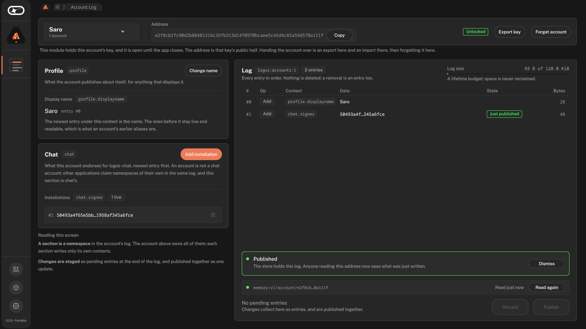

# Account Log

A [Logos Basecamp](https://github.com/logos-co/logos-basecamp) app that holds an
account's key and writes its [AccountLog](https://lip.logos.co/identity/raw/accountlog.html):
the signed, append-only log an account is. It also reads accounts whose key is
held elsewhere.



## Install

In Logos Basecamp 0.3.0, open **Applications** and install **Account Log**.

## What it does

- Creates an account, imports one made elsewhere, or observes one by address.
- Sets the account's display name (`profile.displayname`, per the
  [Account Profile](https://lip.logos.co/identity/raw/profile.html) spec) and
  endorses or revokes logos-chat installation keys (`chat.signer`).
- Stages edits and publishes them as one signed update: all of them or none.
- Seals a key with a password, per account, and exports or forgets it.

Keys stay in the app's vault, one file per account, in
`module_data/accountlog_ui/vault`: under the `--user-dir` basecamp was started
with, or else under `~/.local/share/Logos/ui-host` on Linux.

## Where logs are published

The AccountLog spec leaves distribution open, and there is no delivery topic
for account logs yet. So for now the app publishes over HTTP to chat-store's
`/v1/account` route on devnet (`https://devnet.chat-kc.logos.co`), which
accepts a log only where it extends the one it holds, and serves every log by
address. A published log is permanent.

The plan is for account logs to be broadcast over λDelivery and kept in an
Execution Zone
([logos-chat#268](https://github.com/logos-messaging/logos-chat/issues/268)).
The app reaches its store only through the account crate's provider traits
(`rust-core/src/store.rs`), which is where that switch lands.

## Develop

```sh
nix build   # the plugin
nix run     # the app in logos-standalone-app
```

`rust-core/` makes every account decision (vault, staging, store client) behind
the C ABI in `include/account_core.h`; `src/` is the Qt backend and the QML
view. `LOGOS_ACCOUNTLOG_STORE_URL` points the app at another store, and
`memory` selects an in-process one; `LOGOS_ACCOUNTLOG_VAULT_DIR` moves the
vault.

The [tutorial](https://logos-co.github.io/logos-accounts-ui/) is executable:
CI builds the app, drives it through a whole account headless and publishes
the report. `.github/workflows/` has every check CI runs.

## License

MIT or Apache-2.0, at your option.
